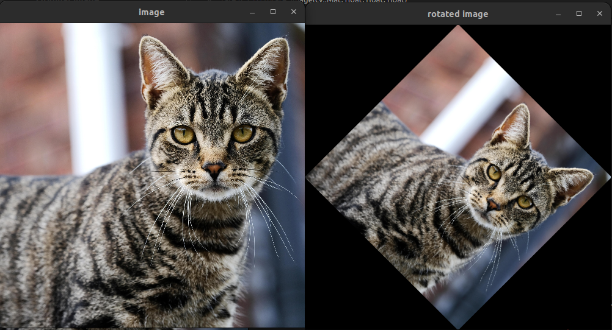
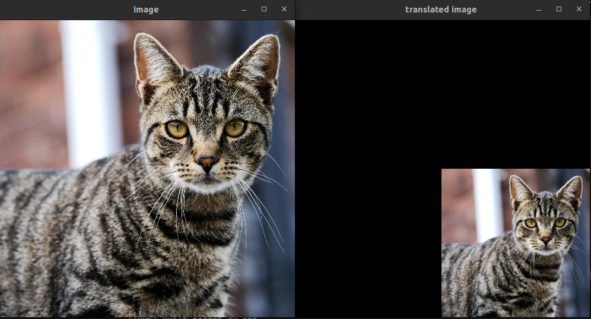
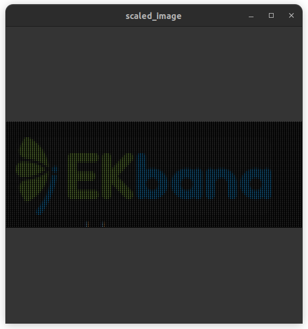
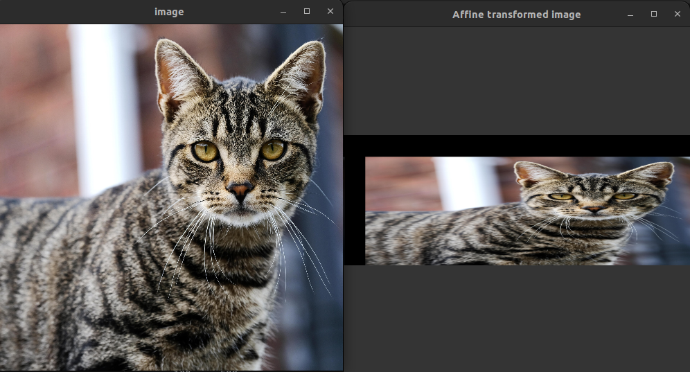
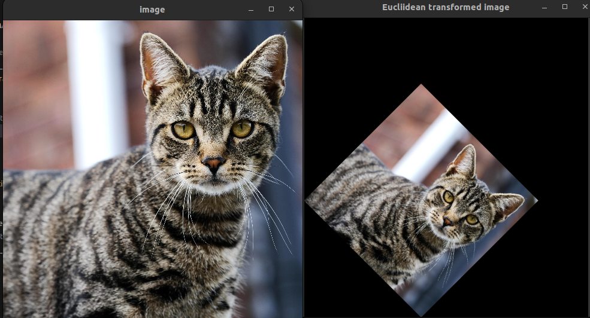
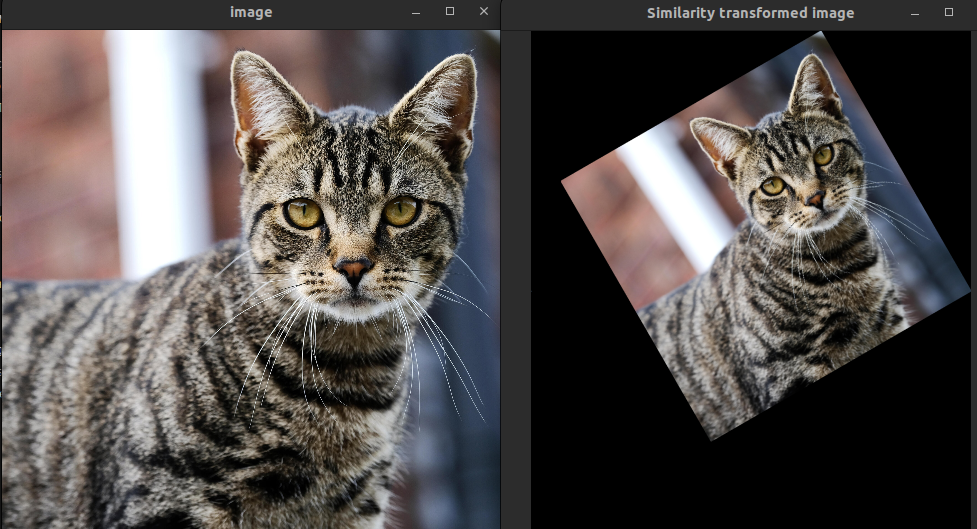
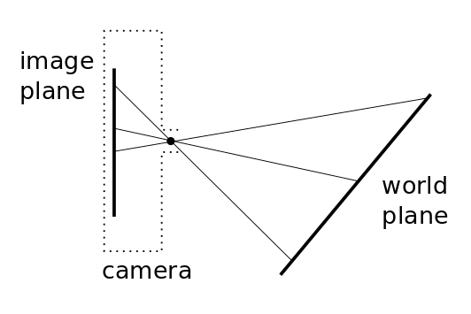
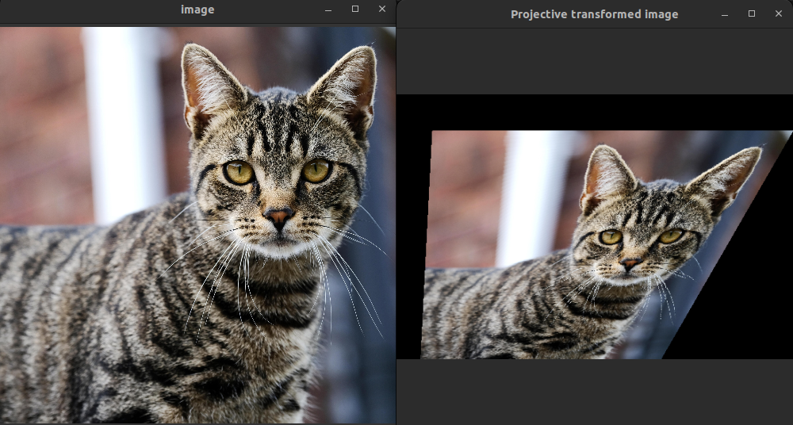
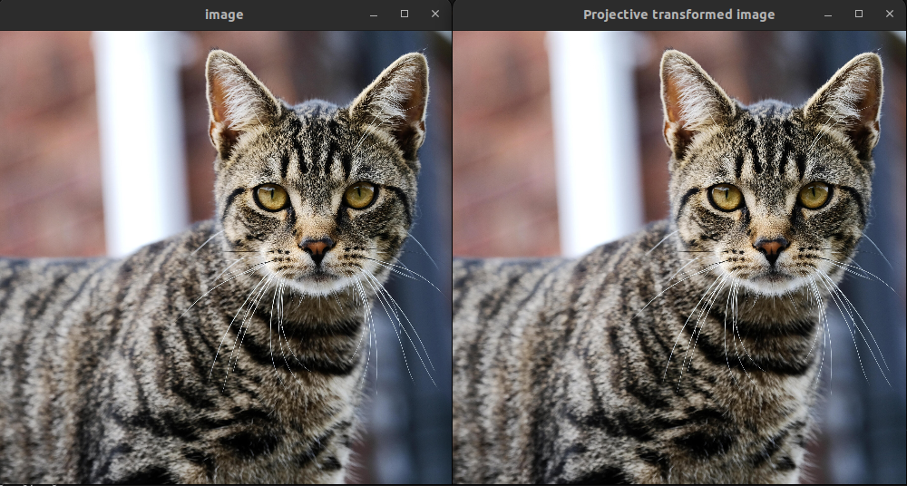

# 2D Transformation 
**Manipulating Image Using 2D Transformation**

## Image Rotation
In Image Rotation we rotate the image by a certain angle either in clockwise or anti-clockwise direction. When rotating we have to fix the center of rotation `COR`.

`Rotation of an object` has two parameters:

- **Angle of rotation**
    
  The `angle of rotation` defines the degrees by which we rotate the object. It also defines the direction of rotation. If it is positive, it is known as `counter-clockwise/anti-clockwise rotation`, and if it is negative, it is known as `clockwise rotation`.

- **Centre of rotation(COR)**

  The `center of rotation` defines the point about which you are going to rotate the object. The above example turns the object about the origin(generally, we take origin as COR, by default). It is always fixed.


A point $`P(x,y)`$, which rotates about the origin. mathematically can be represented as  $`P^{'}`$.


```math
x' = xcos\theta - ysin\theta
\\
y' = xsin\theta + ycos\theta
```

If the COR was not the origin but was point (a,b), the rotated point will be:
```math
x' = (x-a)cos\theta - (y-b)sin\theta
\\
y' = (x-a)sin\theta + (y-b)cos\theta
```

**In Matrix Form**

The equation can be represented in Matrix form as


```math
P' = P.R
\\
\text{where R is the rotation matrix}
\\

\text{P' is the rotated point}
\\

\text{P is the original point}
```


$`R_c`$ is the clockwise rotation matrix  
$`R_a`$ is the anticlockwise rotation matrix

```math
{R_a} = 
\begin{bmatrix}
cos\theta & -sin\theta
 \\
\;
 \\
sin\theta & cos\theta
\end{bmatrix}
\\
{R_c} = 
\begin{bmatrix}
cos\theta & sin\theta
 \\
-sin\theta & cos\theta
\end{bmatrix}
```


**3D rotation**
In 3D we rotate around `axis of rotatioin`
 
 when we rotate the point along a z-axis through an angle $`\theta`$.

```math
x' = xcos\theta - ysin\theta
\\
y' = xsin\theta + ycos\theta
\\
z' = z
```

$`z^{'}=z`$ as it rotates about the z-axis.

Rotation matrix with z-axis as `axis of rotation`

```math
{R_a} = 
\begin{bmatrix}
cos\theta & -sin\theta & 0
 \\
sin\theta & cos\theta & 0
\\
0 & 0 & 1
\end{bmatrix}

{R_c} = 
\begin{bmatrix}
cos\theta & sin\theta & 0
 \\
-sin\theta & cos\theta & 0
\\
0 & 0 & 1
\end{bmatrix}
```

**Rotate Function**  
For this rotated image , i have set the rotated image size to be a size of a rectangle that bounds the four corner of the rotated image.

```c++

cv::Rect bounding_rect = boundingRect(rotated_corner_points );

```
And for rotating the image we loop through each pixel of the original image and copy its pixel value to the rotated image.

```c++

cv::Point2f rotate_point(cv::Point2f point, float angle , float a , float b ){
    float x,y;
    x =  int( (point.x- a)* cos(angle) - (point.y- b)*sin(angle));
    y =  int( (point.x - a)* sin(angle) + (point.y- b)*cos(angle));
    return cv::Point2f(x,y);
}


cv::Point2f rotated_point;
int x,y ;
// (a,b) is the center of the rotation 
    for(int i = 0 ; i < image_width ; i++ ){
        for(int j = 0 ; j < image_height ; j++ ){
 
        rotated_point = rotate_point(cv::Point2f(i,j),angle,a,b);
        x = int(rotated_point.x) - tx;
        y = int(rotated_point.y) - ty; 
        if ( x >=0 && y>=0 && x <rotated_image.size[1] &&  y<rotated_image.size[0]){
        rotated_image.at<cv::Vec3b>(y , x ) = image.at<cv::Vec3b>(j, i) ; 
        }
        }
    }

}

```

**Output of Image Rotation**



## Translation
It involves shifting of image from one place to another by a certain constant. It shifts by adding a certain constant vector known as `Translation Vector`

In 2D system, image is translated by adding the translation vector $`x`$ and $`y`$ components separately to the $`x`$ and $`y`$ coordinates of the points of the object respectively.   
If $`P(x,y)`$ be any point, then the translated point $`P'(x',y')`$ for translation vector, $`T(t_x, t_y)`$ become:

```math
x' = x + t_x
\\
y' = y + t_y
```
** Matrix Representation

```math
P' = P + T 

\begin{bmatrix}
x' \\ y'
\end{bmatrix}=
\begin{bmatrix}
x \\ y
\end{bmatrix}
+
\begin{bmatrix}
t_x \\ t_y
\end{bmatrix}
```
where, 

P represents the original point
P' represents the translated point
T represents the translated vector



`The image hasn't shrinked, only the window size is decreased`.

## Scaling
Scaling of the image means to resize the image(to increase or decrease the image size.

In scaling, we need to scale the object or point with a scaling factor, $`S`$. In 2D, we scale using scaling factor $`S(S_x,S_y)`$ and in 3D, we scale using scaling factor $S(`S_x, S_y, S_z`)$.

**Some important facts**:

* Differential scaling: $`S_x \neq S_y`$
* Uniform scaling: $`S_x = S_y`$ 
* Vertical scaling: $`S_x = 1 , S_y=y,\text{such that y>1}`$
* Horizontal scaling: $`S_x = x , S_y=1,\text{such that x>1}`$
* If scaling factor less than one means that object is closer to the centre  whereas greater than one means that object is far from the center .
* Scaling factor is always positive 

You can scale a point $'P(x,y)'$ using scaling factor $`S(S_x, S_y)`$ as follows:
```math
x' = x. S_x
```
and,

```math
y' = y.S_y
```


In matrix form, you can write the scaling process as:

```math
\begin{bmatrix}
x' \\ y'
\end{bmatrix}=
\begin{bmatrix}
x \\ y
\end{bmatrix}
\begin{bmatrix}
S_x & 0 \\ 0 & S_y 
\end{bmatrix}
```
or,
```math
P' = P.S, \text{where S is scaling matrix} \text{And, P is the original matrix to be scaled.}
```

For 3D coordinates scaling

```math
x' = x. S_x
```

```math
y' = y.S_y
```

```math
z' = z.S_z
```
where, $`(x,y,z)`$ is any 3D point and $`(x',y',z')`$ are new sclaed points. 


The matrix representation for the sclaing factor is:

```math
\begin{bmatrix}
x' \\ y' \\ z'
\end{bmatrix}=
\begin{bmatrix}
x \\ y \\ z
\end{bmatrix}
\begin{bmatrix}
S_x & 0 & 0 
\\ 0 & S_y & 0
\\ 0 & 0 & S_z 
\end{bmatrix}
```

or,
```math
P' = P.S, \text{where S is scaling matrix}
```

**Forward Image Scaling**  

  

If we just copy the $`(x,y)`$ pixel value to $`(S_X * x, S_y*y)`$. Then it will result in holes which we can see above. So we need to map pixel from resized image to original image and we can apply interpolation as well. I followed nearest neighbor approach i.e the value will be filled with the nearest integer pixel value.
  


## Other Transformation

When doing 2D matrix transformation, we can't do translation through single matrix multiplication. First we perform scaling or rotation operation then we have to add translation component.

To solve this issue, we convert the cartesian coordinates into homogeneous coordinate.

## Homogeneous Coordinates
The homogeneous representation of a 2D point P =(x,y) is a 3D point $`P' = (x',y',z')`$. The third coodinate $`z' \ne 0`$ is a fictitious such that :
```math
x = \frac{x'}{z} ,
\\
\;
\\
y = \frac{y'}{z}
```

The homogeneous coordinate of a simple (x,y) coordinate can be easily found as 

```math
\begin{bmatrix}
X \\
Y \\
\end{bmatrix}

=

\begin{bmatrix}
X \\
Y \\
1
\end{bmatrix}
```

## Affine, Euclidean, and Similarity Transformations

In computer vision various types of transformations are used to manipulate objects in a coordinate system. Two classes of linear transformations are present
* **Affine**
* **Projective**

Affine is a particular class of projective transformation.

Three are other common types such as Euclidean, and similarity transformations.

A linear transformation matrix


```math
\begin{bmatrix}
a & b & c \\
d & e & f \\
g & h & i \\
\end{bmatrix}
```

can be interpreted as :
```math
\begin{bmatrix}
a & b  \\
d & e \\
\end{bmatrix}
```

is the rotation matrix.( includes scaling and rotation parameters)

Also,
```math
\begin{bmatrix}
c  \\
f \\
\end{bmatrix}
```


is the translation matrix. `c` represent translation in x and `f` represent translation in y.And the last row is the projection vector.

## Affine Transformation

An affine transformation is a linear transformation followed by a translation. It preserves collinearity and ratios of distances. It can be represented by a matrix multiplication followed by a vector addition.

The general form of an affine transformation matrix is:

```math
\begin{bmatrix}
a & b & c \\
d & e & f \\
0 & 0 & 1 \\
\end{bmatrix}
 
\\
\;
\\

\text{Where \(a\), \(b\), \(c\), \(d\), \(e\), and \(f\) are parameters of the transformation.
}

```

### Example Matrix:

```math
\text{Affine Matrix} = 
\begin{bmatrix}
2 & 0 & 100 \\
0 & 1 & 100 \\
0 & 0 & 1 \\
\end{bmatrix}
```

Now when we apply this transformation to the image the output will be as :



**Transformation Explanation**

This affine transformation matrix performs a scaling by a factor of 2 in the `x-direction`, no scaling in the `y-direction`, and a translation of 100 units in the `x-direction` and 100 units in the `y-direction`.

## Euclidean Transformation

A Euclidean transformation, also known as a rigid transformation, preserves distances and angles. It consists of rotations and translations.

The general form of a Euclidean transformation matrix is:

```math
\begin{bmatrix}
\cos(\theta) & -\sin(\theta) & t_x \\
\sin(\theta) & \cos(\theta) & t_y \\
0 & 0 & 1 \\
\end{bmatrix}
\\
\;
\\
\text{Where \(\theta\) is the rotation angle and \(t_x\), \(t_y\) are the translation parameters.
}
```
### Example Matrix:

```math
\text{Euclidean Matrix} = 
\begin{bmatrix}
\cos(45^\circ) & -\sin(45^\circ) & 200 \\
\sin(45^\circ) & \cos(45^\circ) & 200 \\
0 & 0 & 1 \\
\end{bmatrix}
```

**Image output**




### Transformation Explanation:

This Euclidean transformation matrix performs a rotation of 45 degrees clockwise around the origin and a translation of 200 units in the x-direction and 200 units in the y-direction.

## Similarity Transformation

A similarity transformation is a combination of a Euclidean transformation and a scaling. It preserves angles and ratios of distances.

The general form of a similarity transformation matrix is:

```math
\begin{bmatrix}
s\cos(\theta) & -s\sin(\theta) & t_x \\
s\sin(\theta) & s\cos(\theta) & t_y \\
0 & 0 & 1 \\
\end{bmatrix}
```

Where \(s\) is the scaling factor, \(\theta\) is the rotation angle, and \(t_x\), \(t_y\) are the translation parameters.

### Example Matrix:

```math
\text{Similarity Matrix} = 
\begin{bmatrix}
2\cos(-30^\circ) & -2\sin(-30^\circ) & 100 \\
2\sin(-30^\circ) & 2\cos(-30^\circ) & 200 \\
0 & 0 & 1 \\
\end{bmatrix}
```
**Image Output**


**Thugh the transformation look similar to euclidean here, rotation , scaling and translation all are performed**


### Transformation Explanation:

This similarity transformation matrix performs a scaling by a factor of 2, followed by a rotation of 30 degrees counterclockwise around the origin, and finally a translation of 100 unit in the x-direction and 200 units in the y-direction.


## Projective transformation
It transforms image of one plane into another. Basically it projects image into another plane. The general matrix for image transformation is : 
```math
\begin{bmatrix}
h_{00} & h_{01} & ch_{02} \\
h_{10} & h_{11} & h_{12} \\
h_{20} & h_{21} & h_{22} \\
\end{bmatrix}
```



To carry out the matrix multiplication we first convert all the 2D cartesian points to the homogenous coordinate.

```math
\begin{bmatrix}
x'  \\
y'  \\
z'
\end{bmatrix}

=

\begin{bmatrix}
h_{00} & h_{01} & h_{02} \\
h_{10} & h_{11} & h_{12} \\
h_{20} & h_{21} & h_{22} \\
\end{bmatrix}

*

\begin{bmatrix}
x  \\
y  \\
1  \\
\end{bmatrix}


```


This above matrix multiplication can be simplified as :
```math
x' = \frac{h_{00}*x + h_{01}*y + h_{02}}{h_{20}*x + h_{21}*y + h_{22}}
\\
\;
\\
y' = \frac{h_{10}*x + h_{11}*y + h_{12}}{h_{20}*x + h_{21}*y + h_{22}}

```

### Example Matrix:

```math
\text{Projective Matrix} = 
\begin{bmatrix}
1 & 0 & 50 \\
0 & 1 & 50 \\
0 & 0.001 & 1 \\
\end{bmatrix}
```
 
 **Output Image**




**Identity Matrix**

```math
\text{Identity Matrix} = 
\begin{bmatrix}
1 & 0 & 0\\
0 & 1 & 0 \\
0 & 0 & 1 \\
\end{bmatrix}
```

when we perform projective transform through the identity matrix then we have no change.




## References

* https://shrishailsgajbhar.github.io/post/Image-Processing-Image-Rotation-Without-Library-Functions

* https://medium.com/@junfeng142857/affine-transformation-why-3d-matrix-for-a-2d-transformation-8922b08bce75