# 3D Transformation

Similar to 2D transformation, we can do transformation in 3D point as well. The various 3D transformation are given below :

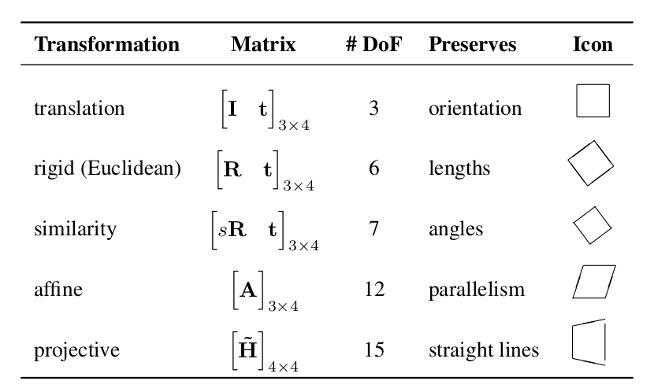

3D transformation can be categorized as :
* **Rigid Transformation**
A rigid transformation is a geometric transformation that preserves distances, angles, and shapes. The rigid transformation includes :
    * Translation
    * Rotation
    * Reflection
* **Non Rigid Transformation**
    * Scaling
    * Shearing
    * Deformation
    * Perspective transformation
    * Warping

All of these transformation can be carried out through a single matrix operation similar to task-8 2D transformationn. Here too we have to convert the 3D cartesian points into homogeneous coordinates.


## Homogeneous Coordinates
The homogeneous representation of a 3D point P =(x,y,z) is a 4D point $`P' = (x',y',z',w')`$. The fourth coodinate $`w' \ne 0`$ is a fictitious such that :
```math
x = \frac{x'}{w} ,
\\
\;
\\
y = \frac{y'}{w}
\\
\;
\\
z = \frac{z'}{w}
```

The homogeneous coordinate of a simple (x,y,z) coordinate can be easily found as 

```math
\begin{bmatrix}
X \\
Y \\
Z
\end{bmatrix}

=

\begin{bmatrix}
X \\
Y \\
Z \\
1
\end{bmatrix}
```

## Translation of 3D coordinates

Similar to the translation in 2D, the mathematical process for translation is same. For any 3D point $P(x,y,z)$, the translated point, $P'$, for given translated vector, $`T(t_x, t_y, t_z)`$   is:


```math
x' = x + t_x
\\
y' = y + t_y
\\
z' = z + t_z
```

### Matrix Representation

You can represent the above calculation in the form matrix equation as follows:

```math
P' = \text{Translation Matrix} \times P 
\\ \; \\
\begin{bmatrix}
x' \\ y' \\ z' 
\end{bmatrix} =

\begin{bmatrix}
1 & 0 & 0 & t_x \\
0 & 1 & 0 & t_y \\
0 & 0 & 1 & t_z 
\end{bmatrix}

\begin{bmatrix}
x \\ y \\ z
\end{bmatrix}

\\ \; \\
[P'] = [I \; \; T][P]

```

**Translation on Point Cloud**

```math
\text{Translation Matrix =}
\begin{bmatrix}
1 & 0 & 0 & 5 \\
0 & 1 & 0 & 5 \\
0 & 0 & 1 & 5 \\
0 & 0 & 0 & 1
\end{bmatrix}

```
**Result**

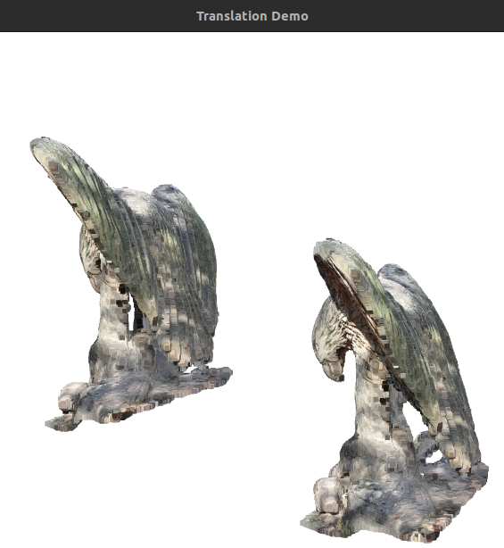


## Rotation Transformation


```math

\text{X rotation : }
\begin{bmatrix}
1 & 0 & 0 & 0 \\
0 & cos(\theta) & sin(\theta) & 0 \\
0 & -sin(\theta) & cos(\theta) & 0 
\\ 0 & 0 & 0 & 1
\end{bmatrix}
 
 \\ \; \\

\text{y rotation : }
\begin{bmatrix}
cos(\theta) & 0 & sin(\theta) & 0 \\
0 & 1 & 0 & 0 \\
-sin(\theta) & 0 & cos(\theta)& 0
\\ 0 & 0 & 0 & 1
\end{bmatrix}

 \\ \; \\

\text{z rotation : }
\begin{bmatrix}
cos(\theta) & sin(\theta) & 0 & 0\\
-sin(\theta) & cos(\theta) & 0 & 0\\
0 & 0 & 1 & 0
\\ 0 & 0 & 0 & 1
\end{bmatrix}

```


## Euclidean Transformation
It consist of rotation and translation.
The matrix representation for the euclidean is:
```math

[P'] = [R \; \; t][P]
\\
 \text{where R is 3 * 3 roational orthonormal matrix.}
```

**Example on Point Cloud**
 
 Translation of (5,5,5) and rotation of 90 degree in x axis.

**Result**
 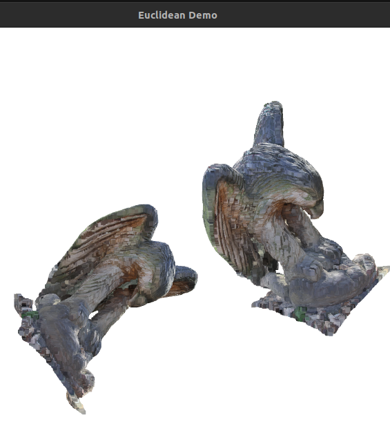

## Similarity
It consist of rotation and translation.
The matrix representation for the euclidean is:
```math

[P'] = [sR \; \; t][P]
\\
 \text{ similar to euclidean but includes scaling as well}
```

We can see the transformation is similar to previous euclidean transformation , but the object has been scaled as well.


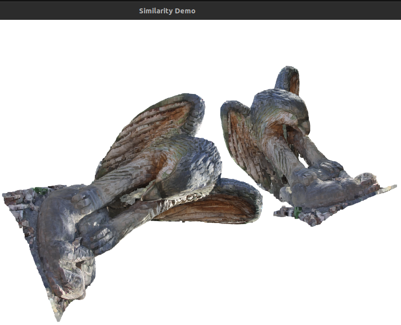
## Affine 
It falls in non rigid transformation  
The matrix representation for the affine is:
```math

\text{affine transformation : }
\begin{bmatrix}
a11 & a12 & a13 & a14\\
a21 & a22 & a23 & a24 \\
a31 & a32 & a33 & a34
\\ 0 & 0 & 0 & 1
\end{bmatrix}
 
```
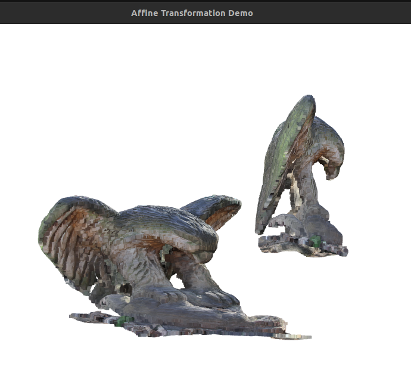
> The affine transformation stretches the object in x-direction

## Projective transformation
The matrix representation for the euclidean is:
```math

\text{projective transformation : }
\begin{bmatrix}
a11 & a12 & a13 & a14\\
a21 & a22 & a23 & a24 \\
a31 & a32 & a33 & a34
\\ a41 & a42 & a43 & a44
\end{bmatrix}
 
```

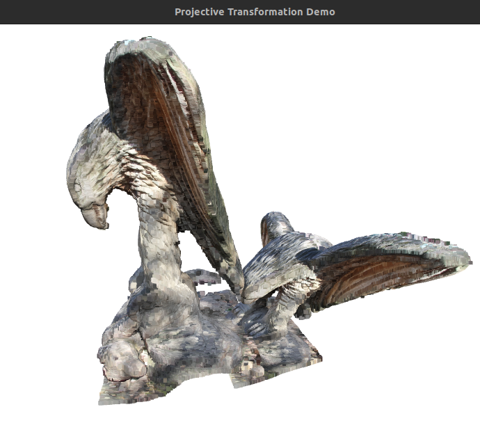
> Note : Random projective transformation matrix has been taken to demonstrate the effect.

# 3d to 2d Projection
 
 Projection refers to mapping an object and point on something. There are two types of 3D projection :
 * Parallel Projection
 * Perspective Projection

In 3D projection, we map the points in three-dimensional onto a  two-dimensional plane.


## Parallel Projection

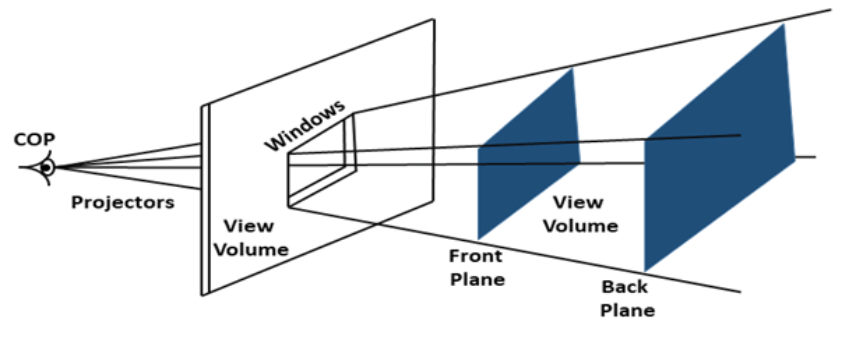

It is the projection of an object in 3D space onto a fixed plane, where projection lines are parallel to each other. As shown in the above figure, all the projection lines are parallel. Two parameters are involved here, Direction of Projection(DOP) and Center of Projection(COP).Here, we choose the direction of the projection(DOP). Parallel lines are preserved here. The Center of Projection(COP) distance to the project plane is infinite. It is of two types:

* Oblique projection
* Orthographic projection


## Perspective Projection

It is similar to parallel projection meaning we project the object into picture plane as well but here the
Similar to the parallel projection, here, we try to project the object onto the picture plane. But here, the distance of the COP from the project plane is finite.  Here, parallel lines do not remain parallel, and angles are not preserved. Any set of parallel lines that are not parallel to the project plane will converge to a point known as the vanishing point. It is of three types:

* One-point Perspective
    - It has one vanishing point in a cube

* Two-point Perspective
    - It has two vanishing point

* Three-point Perspective
    - It has three vanishing point

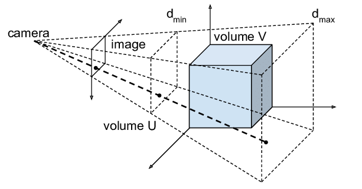

# Projection Matrix

Conversion of 3D points into 2D plane usually can be divided into two parts.
* **Extrinsic transformation**
This transformation depends on the orientation and direction of the camera only.

* **Intrinsic transformation**
This transformation depends on camera internal parameter such as its focal length, aperture, field-of-view, resolution, etc.

Both these transformation are used to convert points from coordinate system to other.

There are different types of coordinate system used they are :

* **World Coordinate System (3D)**
    It is a simple basic 3D cartesian coordinate system
* **Camera coordinate System (3D)**
    Its the coordinate system with relative to camera. It takes into factor such as camera orientation and origin.

**Camera Extrinsic Matrix**
It is the 4*4 transformation matrix that converts points form world coordinate system to the camera coordinate system. It consists of rotation and translation operations.

```math

\begin{bmatrix}
X_c   \\
Y_c  \\
Z_c   \\
1     \\
\end{bmatrix}

=

\begin{bmatrix}
R_{3\times3} & t_{3\times1}   \\
0_{1\times3} & 1_{1\times1}  \\
\end{bmatrix}_{(4\times4)}

\begin{bmatrix}
X_w   \\
Y_w  \\
Z_w   \\
1     \\
\end{bmatrix}


```


**Coordinate system (2D) [Pinhole Model]:**
It is a 2D coordinate system where the 3D points in the camera coordinate system are projected onto a 2D plane of a camera with a pinhole model. This plane is typically normal to the z-axis of the camera coordinate system and is depicted as a yellow plane in the diagrams below.

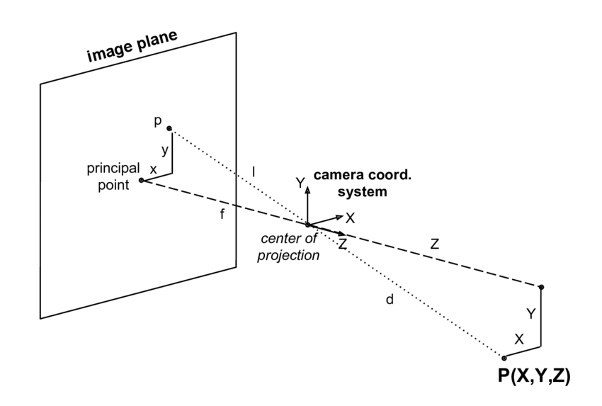

The image are formed when the ray passes the center of projection and makes image in the 2D plane. This removes the depth information of the transformed point.

```math

\frac{X_i}{f} = \frac{X_c}{Z_c} 
\\ \; \\
 \frac{Y_i}{f} = \frac{Y_c}{Z_c} 
\\
\;
\\
X_i = f\times\frac{X_c}{Z_c}
\\ \; \\
Y_i = f\times\frac{Y_c}{Z_c}


```
It can be written in  the projection matrix of a $3\times4$ matrix that describes the mapping of a pinhole camera from 3D points to 2D points. Let `P` represents a 3D point in homogenous coordinates(i.e., 4D coordinates), and `P′` represent the image of this point in the pinhole-camera(a 3D vector). Then, we have the following relation:


```math
P' \sim \mathbf{C}P
```
where $`\mathbf{C}`$ is the projection matrix, and $`\sim`$ implies that left and right-hand sides are equal up to a non-zero scalar-multiplication.

In matrix form, 

```math
\mathbf{C} = 
\begin{bmatrix}
1 & 0 & 0 & 0 \\
0 & 1 & 0 & 0 \\
0 & 0 & 1/f & 0 \\
\end{bmatrix}
\sim
\begin{bmatrix}
f & 0 & 0 & 0 \\
0 & f & 0 & 0 \\
0 & 0 & 1 & 0 \\
\end{bmatrix}
\text{, where f is the camera's focal length s.t. f>0}
```


**Pixel coordinate system (2D):**
 This represents the integer values by discretizing the points in the image coordinate system. 
For image , the origin is considered at the top left corner and the pixel value are discrete we have to discretized our transformed image.

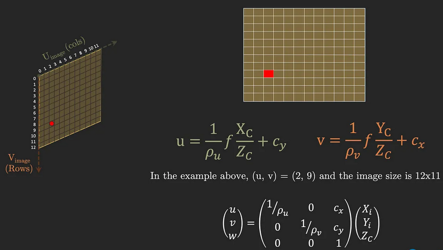

Also if the image is skewed we have to convert into skew axis first.

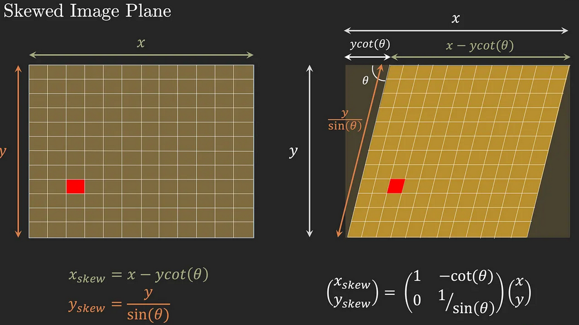

Thus overall the intrinsic camera matrix is
```math

\begin{bmatrix}
u \\
v \\
w 
\end{bmatrix}

= 

\begin{bmatrix}
\frac{f}{\rho_u} & 0 & c_x & 0 \\
0 & \frac{f}{\rho_u} & c_y & 0 \\
0 & 0 & 1 & 0 \\
\end{bmatrix}
\\
\text{ where f is focal length , $c_x,c_y$ are translation operatoor $\rho_u \times \rho_v$ is pixel size}


```

# Orthographic Projection

Orthographic projection is the type of parallel projection in which the parallel lines are perpendicular to the projecting plane. We can also say, DOP is perpendicular to the projection of the plane(POP). It is of three types:

* Front Projection
* Top Projection
* Side Projection

Following is the demonstration of various types of orthographic projection. The following projection differ from one another in the angle they are viewed at.

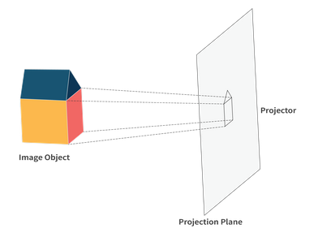

One of the most common matrices, used for orthographic projection, uses 6-tuple(left, right, top, bottom, near, far) for defining it. This six-tuple defines the clipping planes such that the box will have minimum corner at `(left, bottom, -near)` and the maximum corner at `(right, top, -far)`. 

Following matrix represents the orthographic transform:

```math
\mathbf{P} = 
\begin{bmatrix}
\frac{2}{right-left} & 0 & 0 & -\frac{right+left}{right-left} \\
0 & \frac{2}{top-bottom}  & 0 & -\frac{top+bottom}{top-bottom} \\
0 & 0 & -\frac{2}{far-near}  & -\frac{far+near}{far-near} \\
0 & 0 & 0 & 1
\end{bmatrix}
```

We can also represent it as composite transformation i.e., scaling, S, followed by translation, T.

```math
\mathbf{P} = \mathbf{S}\mathbf{T}
```
where,
```math
\mathbf{S} = 
\begin{bmatrix}
\frac{2}{right-left} & 0 & 0 & 0 \\
0 & \frac{2}{top-bottom}  & 0 & 0 \\
0 & 0 & -\frac{2}{far-near}  & 0\\
0 & 0 & 0 & 1
\end{bmatrix}
```
and,
```math
\mathbf{T} = 
\begin{bmatrix}
1 & 0 & 0 & -\frac{right+left}{right-left} \\
0 & 1  & 0 & -\frac{top+bottom}{top-bottom} \\
0 & 0 & -1  & -\frac{far+near}{far-near} \\
0 & 0 & 0 & 1
\end{bmatrix}
```


It's inverse also exists, which is given as follows:

```math
\mathbf{P^{-1}} = 
\begin{bmatrix}
\frac{right-left}{2} & 0 & 0 & \frac{right+left}{2} \\
0 & \frac{top-bottom}{2}  & 0 & \frac{top+bottom}{2} \\
0 & 0 & -\frac{far-near}{2}  & -\frac{far+near}{2} \\
0 & 0 & 0 & 1
\end{bmatrix}
```

# References

https://medium.com/@parkie0517/rigid-transformation-in-3d-space-translation-and-rotation-d701d8859ba8

https://storyofsoumya.medium.com/glsl-with-processing-implementing-3d-transformations-602c711bd96e

https://behreajj.medium.com/3d-transformations-in-processing-de11acdd1fbc

https://medium.com/@parkie0517/rigid-transformation-in-3d-space-translation-and-rotation-d701d8859ba8