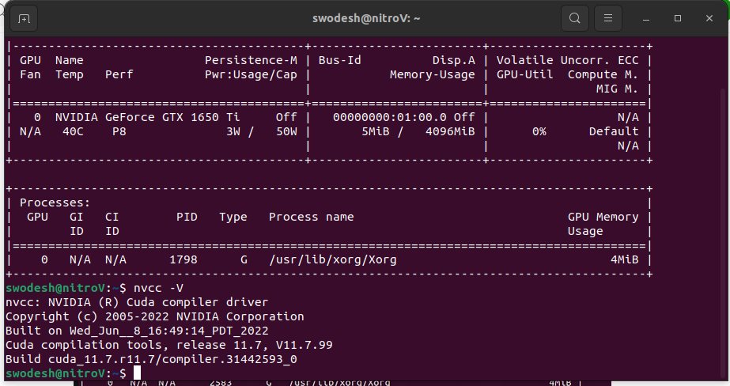

## TASK 4 

**INSTALLING OPENCV , BUILDING FROM SOURCE , INSTALLING CUDA, EXTRA MODULES , AND NON FREE MODULES**

## STEP 1: Installing CUDA
Verify if there is CUDA enabled hardware or not
```bash
$ lspci | grep -i nvidia
```


My Laptop is `Acer Nitro V` with `Ryzen 4600H` and `GTX 1650 Ti` graphics card. So it can support CUDA.

Before installing CUDA
It is better to update the apt
```bash
$ sudo apt update
$ sudo apt upgrade
$ sudo apt install linux-headers-$(uname -r)
```

**Now downloading the necessary dependencies**
```bash
sudo apt-get install g++ freeglut3-dev build-essential libx11-dev libxmu-dev libxi-dev libglu1-mesa libglu1-mesa-dev
```


**Adding PPA repository driver**
```bash
$ sudo add-apt-repository ppa:graphics-drivers/ppa
```

**Installing Nvidia Drivers**
```bash
$ sudo apt install libnvidia-common-515
sudo apt install libnvidia-gl-515
sudo apt install nvidia-driver-515
sudo reboot
```

**Verifying the installation**
```bash
$ nvidia-smi
```


## INSTALLING CUDA
```bash
$wget https://developer.download.nvidia.com/compute/cuda/repos/ubuntu2204/x86_64/cuda-ubuntu2204.pin

$sudo mv cuda-ubuntu2204.pin /etc/apt/preferences.d/cuda-repository-pin-600

$sudo apt-key adv --fetch-keys https://developer.download.nvidia.com/compute/cuda/repos/ubuntu2204/x86_64/3bf863cc.pub

$sudo add-apt-repository "deb https://developer.download.nvidia.com/compute/cuda/repos/ubuntu2204/x86_64/ /"

$sudo apt-get update

$sudo apt install cuda-11-7 
```


A `machine owner key` will be generated. And a password will be asked if `UEFI` is enbaled , create the password and reboot.

```bash
$sudo reboot
```

**UPDATING THE PATH FOR CUDA**
```bash
$ echo 'export PATH=/usr/local/cuda-11.7/bin:$PATH' >> ~/.bashrc
$ echo 'export LD_LIBRARY_PATH=/usr/local/cuda-11.7/lib64:$LD_LIBRARY_PATH' >> ~/.bashrc
$ source ~/.bashrc
$ sudo ldconfig
```


## VERIFYING THE CUDA INSTALLATION
```bash
$ nvidia-smi
$ nvcc -V
```
Image is seen like this after successful installation



 ## INSTALLING cuDNN

**Downloading cuDNN ( Version 8.5.0 )**

```bash
$ wget https://developer.download.nvidia.com/compute/redist/cudnn/v8.5.0/local_installers/11.7/cudnn-linux-x86_64-8.5.0.96_cuda11-archive.tar.xz
```

**Extracting and Copying Files**

```bash
$ tar -xvf cudnn-linux-x86_64-8.5.0.96_cuda11-archive.tar.xz

$ sudo cp cudnn-*-archive/include/cudnn*.h /usr/local/cuda/include 

$ sudo cp -P cudnn-*-archive/lib/libcudnn* /usr/local/cuda/lib64 

$ sudo chmod a+r /usr/local/cuda/include/cudnn*.h /usr/local/cuda/lib64/libcudnn*
```

**NOW CUDA IS SUCCESSFULLY INSTALLED**

# Installing OpenCV using Cmake 

Before installing OpenCV with Cuda. We have to make sure the CUDA along with Nvidia drivers are properly installed.

**Installing cmake and g++**
```bash
$ sudo apt install cmake
$ sudo apt install gcc g++
```

`GTK` is requried for `GUI features, Camera support (v4l), Media Support (ffmpeg, gstreamer…)`, etc.:

```bash
$ sudo apt install libavcodec-dev libavformat-dev libswscale-dev

$ sudo apt install libgstreamer-plugins-base1.0-dev libgstreamer1.0-dev

$ sudo apt install libgtk-3-dev
```

**Adding Support for various image formats**

```bash
$ sudo apt install libpng-dev libjpeg-dev libopenexr-dev libtiff-dev libwebp-dev
```

Creating a directory named `opencv` and inside that directory create a folder named build
also `clone the opencv repository` inside it
along with `opencv-contrib repository (Required for Extra Modules)`  from the github

```bash
$ sudo mkdir opencv
$ cd opencv
$ sudo mkdir build
$ git clone https://github.com/opencv/opencv.git
$ git clone https://github.com/opencv/opencv_contrib.git
```


**Finding the GPU**  Compute Compatibility
We can check the GPU compatibility from the [nvidia website](https://developer.nvidia.com/cuda-gpus)


So my for my GPU
`CUDA_ARCH_BIN = 7.5`

Now go inside the build directory and use cmake to build the opencv from source
```bash
$ cmake \
-D CMAKE_BUILD_TYPE=RELEASE \
-D CMAKE_INSTALL_PREFIX=/usr/local \
-D WITH_CUDA=ON \
-D WITH_CUDNN=ON \
-D WITH_CUBLAS=ON \
-D WITH_TBB=ON \
-D OPENCV_DNN_CUDA=ON \
-D OPENCV_ENABLE_NONFREE=ON \
-D CUDA_ARCH_BIN=7.5 \
-D OPENCV_EXTRA_MODULES_PATH=$HOME/opencv_contrib/modules \
-D BUILD_EXAMPLES=OFF \
-D OPENCV_GENERATE_PKGCONFIG=YES \
-D HAVE_opencv_python3=ON \
..
```


We can see the prebuild is successful.
Now To compile opencv with GPU support we need to know how many cores the cpu has
To find the cpu cores we can do
```bash
$ lscpu
```


Now to compile we will use make
```bash
$ make -j 12
```
where `j` means `job`

Now after it is done

```bash
$ sudo make install
```


Now finally run
```bash
$ sudo apt-get install libopencv-dev
```
**Check opencv version**
```bash
$ pkg-config --cflags --libs opencv4
```

## **Solving Compile Errors**

There were some errors but I solved it with this.
The opencv library files weren’t being detected so, first I searched for `libopencv_core`
The file `libopencv_core.so.4.9.0` was located in `/usr /local /lib`

so I created a `opencv.conf` file and entered following command

$ sudo touch /etc/ld.so.conf.d/opencv.conf 

and wrote `“ /usr /local /lib “`
and then 
```bash
$ sudo ldconfig -v
```

and when compiling the program code in Vscode.There was `GTK environment error` in Vscode which I solved with
```bash
$ unset GTK_PATH
```
 
## References

https://medium.com/@juancrrn/installing-opencv-4-with-cuda-in-ubuntu-20-04-fde6d6a0a367

https://medium.com/analytics-vidhya/how-to-install-opencv-for-visual-studio-code-using-ubuntu-os-9398b2f32d53

https://docs.opencv.org/4.x/d7/d9f/tutorial_linux_install.html

https://code.visualstudio.com/docs/cpp/config-linux


