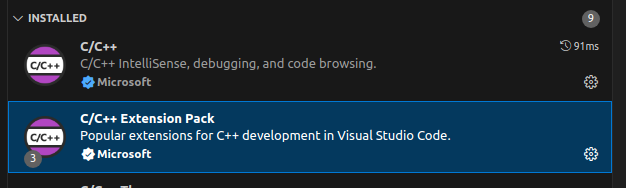
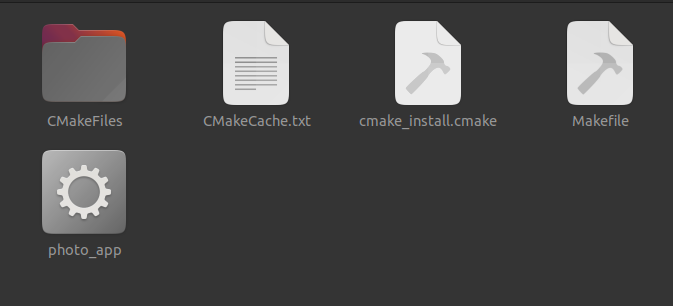
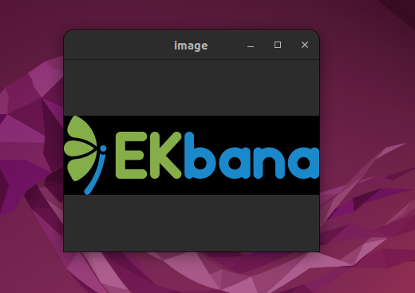

# Task 5

The objective of this task is to be familiar with the makefile and cmake for building the application.

## Building hello world application executable

Install the vscode and then install the following extension  pack 



**Writing a Simple Hello World Program**

```code
#include <iostream>

using namespace std;

int main(){
   std::cout << "Hello ! I am Swodesh Sharma, a ML trainee at EKbana ." << endl ;
   return 0;
}

```
Now in the directory where we have kept this `hello.cpp` file. We have to create a directory named `build`. Also we have to create a file name `CMakeLists.txt`
Inside the `CMakeLists.txt` we have to define our build configuration.

```
cmake_minimum_required(VERSION 3.22.1)

project(Hello Version 1)

set(CMAKE_CXX_STANDARD 11)

add_executable(my_file hello.cpp)
```

* **cmake_minimum_required**  : This gives information about the minimum version of the Cmake to utilize when building.

* **project** : This gives information about the project name and its version

* **set** : Tells that this project should be built using C++ 11

* **add_executable** : my_file here is the name of the executable file and hello.cpp is the target file.

## Building the Executable

We can build the program with g++ as well
```
$ g++ -o output_file_name hello.cpp
```

**Build Using Cmake**  
Once the `CMakeLists.txt` is ready. Browse inside the build directory which we created earlier and enter the following command

```
$ cmake ..
```
**Following output would be seen in the compiler**
``` bash
swodesh@nitroV:~/Documents/EKbana/Task 4/Using Cmake/build$ cmake ..
-- The C compiler identification is GNU 11.4.0
-- The CXX compiler identification is GNU 11.4.0
-- Detecting C compiler ABI info
-- Detecting C compiler ABI info - done
-- Check for working C compiler: /usr/bin/cc - skipped
-- Detecting C compile features
-- Detecting C compile features - done
-- Detecting CXX compiler ABI info
-- Detecting CXX compiler ABI info - done
-- Check for working CXX compiler: /usr/bin/c++ - skipped
-- Detecting CXX compile features
-- Detecting CXX compile features - done
-- Configuring done
-- Generating done
-- Build files have been written to: /home/swodesh/Documents/EKbana/Task 4/Using Cmake/build
```

Now we create the executable using make command
```bash
$ make
```

**Following output would be seen in the terminal**

```bash
swodesh@nitroV:~/Documents/EKbana/Task 4/Using Cmake/build$ make
[ 50%] Building CXX object CMakeFiles/my_file.dir/hello.cpp.o
[100%] Linking CXX executable my_file
[100%] Built target my_file
```

**Running the executable**
```bash
./my_file
```
**Following Output will be obtained**
```bash
swodesh@nitroV:~/Documents/EKbana/Task 4/Using Cmake/build$ ./my_file
Hello ! I am Swodesh Sharma, a ML trainee at EKbana .
```

**We just created a executable using CMake**.


# Using Cmake to Create OpenCV Executable

For this task i will be creating a simple image opening application.
There will be two files one will be the `main.cpp` and another will be `func.h` . The necessary function will be kept inside the `func.h` .

**func.h code**
```code
#include <opencv2/highgui.hpp>
#include <iostream>

int show_image(cv::Mat image){
     if(! image.data)
        {
            std::cout<<"No image file present" << std::endl;
            return 0;
        }    
        
    cv::namedWindow("image", cv::WINDOW_NORMAL);
    cv::resizeWindow("image",100,20);
    cv::imshow("image", image);
    cv::waitKey(0);
    return 1;
}

```

**main.cpp code**
```code
#include "func.h" 
 
int main(int argc ,char* argv[]){
    if(argc < 2){
        std::cerr << "Provide valid image path" << std::endl;
    }

cv::Mat image;
image = cv::imread(argv[1],cv::IMREAD_COLOR);  
show_image(image);
return 0;
}
 

```

The function accepts argument from the terminal.


**CMakeLists.txt**
```
cmake_minimum_required(VERSION 3.13)

# set the project name and version
project (photo)

set (CMAKE_CXX_STANDARD 17)
find_package(OpenCV REQUIRED) 

include_directories(${OpenCV_INCLUDE_DIRS}) 
add_executable(photo_app main.cpp)
target_link_libraries(photo_app ${OpenCV_LIBS})
```

**Terminal Output**
```bash
swodesh@nitroV:~/Documents/EKbana/Task 4/build$ cmake ..
-- Configuring done
-- Generating done
-- Build files have been written to: /home/swodesh/Documents/EKbana/Task 4/build
swodesh@nitroV:~/Documents/EKbana/Task 4/build$ make
Consolidate compiler generated dependencies of target photo_app
[ 50%] Building CXX object CMakeFiles/photo_app.dir/main.cpp.o
In file included from /home/swodesh/Documents/EKbana/Task 4/main.cpp:1:
/home/swodesh/Documents/EKbana/Task 4/func.h: In function ‘int show_image()’:
/home/swodesh/Documents/EKbana/Task 4/func.h:16:1: warning: control reaches end of non-void function [-Wreturn-type]
   16 | }
      | ^
[100%] Linking CXX executable photo_app
[100%] Built target photo_app
swodesh@nitroV:~/Documents/EKbana/Task 4/build$ 
```
**If we browse through the build folder, an executable will be present there**



**Now, if to run the photo app.**

* Create a build directory
* go inside it and type command

```
$ cmake ..
$ make
$ ./cv_app ../img/test.png
```
If there is any error regarding `GTK` ( Related to Vscode)

```
$ unset GTK_PATH
```





## Using Makefile To Create Executable for the same Application

**Create a file named Makefile with no extension**

**Makefile**
```code
CC = g++
PROJECT = my_photo_app
SRC = main.cpp
LIBS = `pkg-config --cflags --libs opencv4`
$(PROJECT) : $(SRC)
	$(CC) $(SRC) -o $(PROJECT) $(LIBS)
```

and go to the terminal and type the command
```bash
make
```
And we get a executable which we can run.