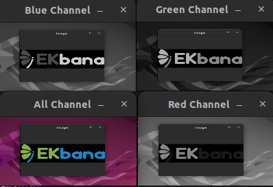
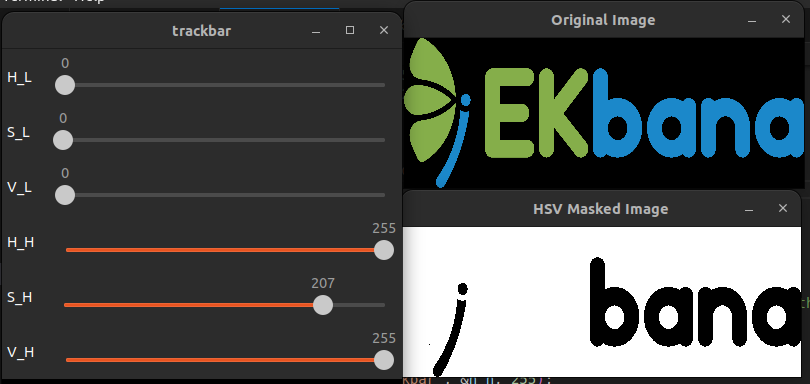
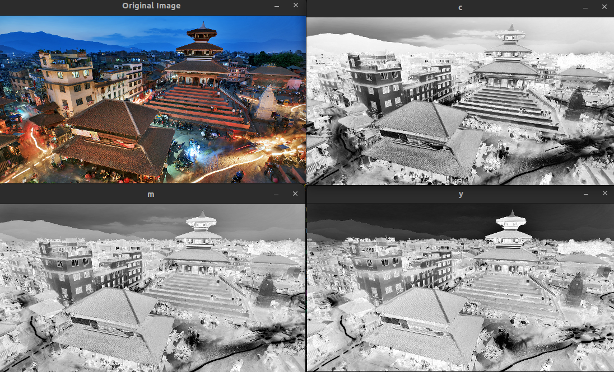
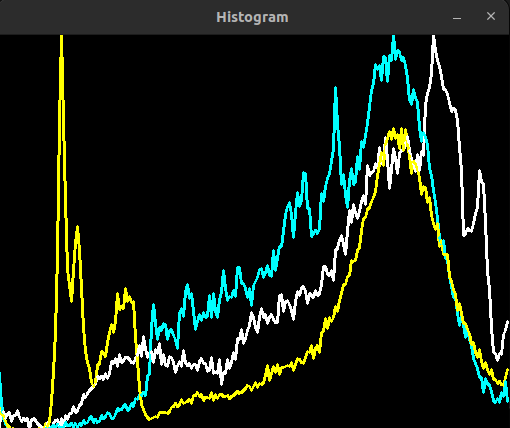
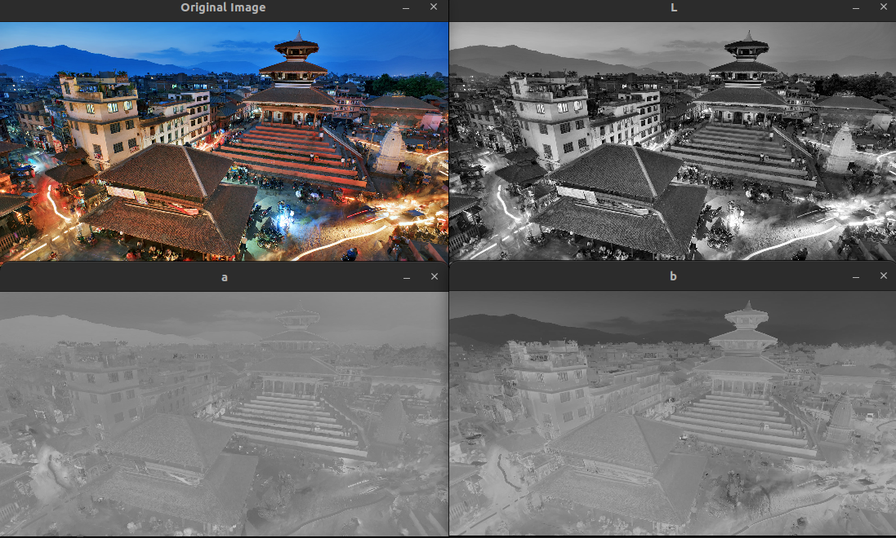
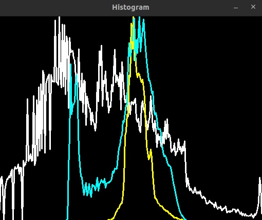
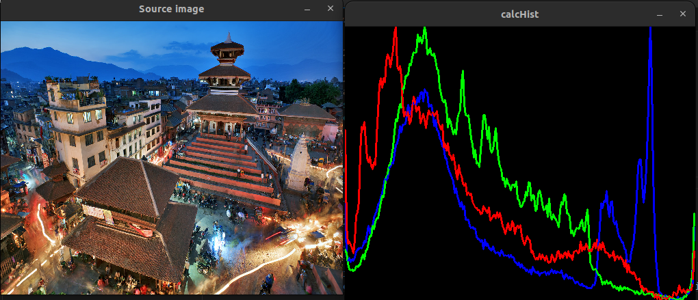
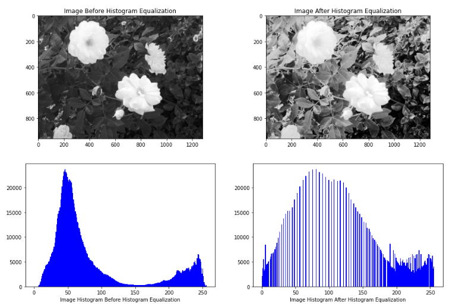
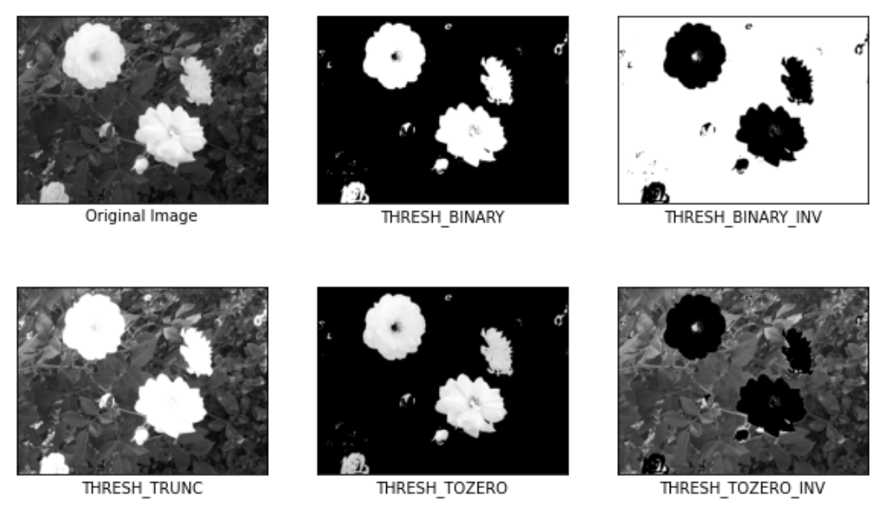

# Task understanding Color Spaces and their histogram

## Image formation
Lets take a example of an image given below :


The above image is a single channel image and if we zoom it into the image further, it is made up of different pixels. The intensity of pixels varies from 0 to 255. O represents complete black and 255 represent pure white.


For a colorful image they will have three channels RGB whose each intensity varies from 0 to 255.


## Color Space
Color space refers to the specific organization of colors to represent the image.

Some of the most common color space are :

* RGB
* CMYK
* YUV
* HSV
* LAB

`Color Model` refers to the the abstract method of representing color in color space. Color space encompasses both color model and abstract mapping function.

The color of the image is dependent on the device producing it like `Camera`.

## Linear and Non Linear Color Space

In linear color space, the numbers stored in the pixel value and the intensities represented by them are linear. So if the number is doubled, the internsity also doubles. So, if we add, subtract, multiply any two pixel value and it will have same effect on the intensities. Eg, `Linear RGB Space`

The problem with linear space occurs due to the `human eyes's sensitivity` to light at low intensities.So, in linear color space, we are working with higher number of light shades so to solve this we have non linear color space i.e `SRGB` . In SRGB the colors are non linear. the color intensities follow a curve and the curve is shallow at bottom and steep at top so there is more darker shades and lesser lighter shades


## RGB Color Space
In RGB color space more the the intensities of each channel is increased more the pixel becomes brighter.

One color image matrix = red matrix + blue matrix + green matrix


OpenCV uses color format `BGR` instead of `RGB`

```c++
cv::Mat different_channel[3];
cv::split(img_src,different_channel);
cv::imshow("All Channel",img_src);
cv::imshow("Blue Channel", different_channel[0]);
cv::imshow("Green Channel", different_channel[1]);
cv::imshow("Red Channel",different_channel[2]);

```
**Heres the output of different color channels**



## HSV COLOR SPACE

`HSV` refers to the Hue, Saturation and Value  

* `Hue` corresponds to the color components (base pigment) hence just by selecting a range of Hue , we can select any color. Hue ranges from 

* `Saturation` is the amount of color (depth of the pigment). It ranges from 0-100%

* `Value` is basically the brightnessof the color. It ranges from 0-100 %.


**Converting BGR to HSV in OpenCV**

```c++
cv::cvtColor(source_image, destination_image , cv::COLOR_BGR2HSV);
```

**We can use HSV thresholding for object detection**

**Trackbar Creation**
```c++
cv::createTrackbar("Value", "trackbar", &var, 255);  
// Var refers variable where value from the trackbar will be stored
```


**Masking Using HSV Thresholding with trackbar**  
We declare variables to store trackbar value. Since we are masking using HSV color space, we need six values i.e lower and upper threshold of each channels. The value they contain will be the initial value when trackbar is loaded.
```c++
int h_l = 0, s_l = 110, v_l = 153;
int h_h = 19, s_h = 240, v_h = 255;
cv::createTrackbar("H_L", "trackbar", &h_l, 255);
cv::createTrackbar("H_H", "trackbar", &h_h, 255);
......
......
```

Now HSV masking can be done as :

```C++
while (true) {
    cvtColor(img, hsv_image, COLOR_BGR2HSV);
    inRange(hsv_image, Scalar(h_l, s_l , v_l), Scalar(h_h, s_h, v_h), hsv_image);
    // some conditional break statements
}

```
**By varying trackbar value we can mask any color**


So HSV masking helps alot in object tracking. 

## CMY Color Space
This is the color space which is obtained by subtracting the max intensity level of a channel with the current channel value. To convert RGB to CMY we use the formula given below :

```math 

\left(\begin{array}{c} 
C \\
M \\
Y
\end{array}\right) =
\left(
    \begin{array}{c}  
    255 - R \\
    255 - G \\
    255 - B   
    
    \end{array}
    \right)

```

There is also a normalized form 

```math 
$$
\left(\begin{array}{c} 
C \\
M \\
Y
\end{array}\right) =
\left(
    \begin{array}{c}  
    1 - R/255 \\
    1 - G/255 \\
    1 - B/255   
    
    \end{array}
    \right)
$$ 
```
**BGR to CMY Converstion**
```c++
for(int i = 0 ; i < 4 ; i++) {
    dst.push_back(Mat(bgr.size(), CV_8UC1));
}
    // Looping through each pixel
for (int i = 0; i < bgr.rows; i++) {
    for (int j = 0; j < bgr.cols; j++) {
        dst[0].at<uchar>(i, j) = 255 - bgr.at<Vec3b>(i, j)[2] ;  
        dst[1].at<uchar>(i, j) = 255 - bgr.at<Vec3b>(i, j)[1]   ; 
        dst[2].at<uchar>(i, j) = 255 - bgr.at<Vec3b>(i, j)[0]  ;
    }
}
cv::imshow("c", dst[0]);
cv::imshow("m", dst[1]);
cv::imshow("y", dst[2]);

```
**Output of individual CMY channels**


If we look into histogram we can find individual channels intensity plot.




## YUV Color Space
Humans are more susceptible to brightness information than color information. In `YUV` color space,   
`Y` represents Luminance
`U` and `V` represent chroma

YUV color space can be used to compress color by reducing part of information of the chroma which are less susceptible to humans.

**RGB to YUV Conversion Formula**
```math
$$
\left(\begin{array}{c} 
Y \\
U \\
V
\end{array}\right) =

\left(
    \begin{array}{c c c}  
    0.299 & 0.587 & 0.114 \\
    -0.299 & -0.587 & 0.886 \\
    0.701 & -0.587 & -0.114   
    
    \end{array}\right)

\left(\begin{array}{c} 
R \\
G \\
B
\end{array}\right)    
$$ 
```

**Application of YUV Color Space**

* Television Broadcasting
* H264 Video Formats , Processing , Transmission
* CV Algorithms


**BGR TO YUV Conversion**
```c++
cv::cvtColor(img,dst,cv::COLOR_BGR2YUV);
```

## LAB Color Space
This color space is heavily used in computer vision.


**L-channel**: The “lightness” of the pixel. This is like the value in HSV and controls the brightness. This value goes up and down the vertical axis, white to black, with neutral grays at the center of the axis.

**a-channel**: This channel controls color in range Green to Magenta. Originates from the center of the L-channel and defines pure green on one end of the spectrum and pure red on the other.

**b-channel**: This channel controls color in range Blue to Yellow. Also originates from the center of the L-channel, but is perpendicular to the a-channel. The b-channel defines pure blue at one of the spectrum and pure yellow at the other


```c++
cv::cvtColor(src,dst,cv::COLOR_BGR2Lab);
cv::split(dst,lab_channel);
// Display results
imshow("Original Image", img);
imshow("L", lab_channel[0]);
imshow("a", lab_channel[1]);
imshow("b", lab_channel[2]);
```



If we look into histogram we can find individual channels intensity plot.



## HISTOGRAMS
`Historgram` refers to the frequency distribution. And a `Image Histogram` is a graph, that gives the pixel intensity distribution of an image that ranges from 0 to 255.

**Sample HISTOGRAM of RBG Image, with histogram of individual color channels**

```c++
 
 vector<Mat> bgr_channels;
 split( img, bgr_channels );
 int histSize = 256;
 float range[] = { 0, 256 }; //the upper boundary is exclusive
 const float* histRange[] = { range };
 bool uniform = true, accumulate = false;
 Mat b_hist, g_hist, r_hist;
 calcHist( &bgr_channels[0], 1, 0, Mat(), b_hist, 1, &histSize, histRange, uniform, accumulate );
 calcHist( &bgr_channels[1], 1, 0, Mat(), g_hist, 1, &histSize, histRange, uniform, accumulate );
 calcHist( &bgr_channels[2], 1, 0, Mat(), r_hist, 1, &histSize, histRange, uniform, accumulate );
 int hist_w = 512, hist_h = 400;
 int bin_w = cvRound( (double) hist_w/histSize );
 Mat histImage( hist_h, hist_w, CV_8UC3, Scalar( 0,0,0) );
 normalize(b_hist, b_hist, 0, histImage.rows, NORM_MINMAX, -1, Mat() );
 normalize(g_hist, g_hist, 0, histImage.rows, NORM_MINMAX, -1, Mat() );
 normalize(r_hist, r_hist, 0, histImage.rows, NORM_MINMAX, -1, Mat() );
 for( int i = 1; i < histSize; i++ )
 {
 line( histImage, Point( bin_w*(i-1), hist_h - cvRound(b_hist.at<float>(i-1)) ),
 Point( bin_w*(i), hist_h - cvRound(b_hist.at<float>(i)) ),
 Scalar( 255, 0, 0), 2, 8, 0 );
 line( histImage, Point( bin_w*(i-1), hist_h - cvRound(g_hist.at<float>(i-1)) ),
 Point( bin_w*(i), hist_h - cvRound(g_hist.at<float>(i)) ),
 Scalar( 0, 255, 0), 2, 8, 0 );
 line( histImage, Point( bin_w*(i-1), hist_h - cvRound(r_hist.at<float>(i-1)) ),
 Point( bin_w*(i), hist_h - cvRound(r_hist.at<float>(i)) ),
 Scalar( 0, 0, 255), 2, 8, 0 );
 }
 imshow("Source image", img );
 imshow("calcHist", histImage );
}
```

**Output**


Histogram helps us determine the optimal value for thresholding.

## Histogram Equalization
The goal of histogram equalization is to find and apply a point operation such that the histogram of the modified image is flat. `Therefore
histogram equalization can be used to improve contrast of Image`. It is a method in image processing of contrast enhancement using the image's histogram.

```c++
cv::equalizeHist( src, dst );
```
It works by stretching the concentrated intensity range.




## Thresholding

Thresholding is a type of Image Segmentation in which you segment the image into the foreground and background.

**Types of Thresholding**

* **Global Thresholding**  
    * **cv::THRESH_BINARY**  
        Creates a binary image where a value below the threshold is 0, and the above threshold is 255.
    * **cv::THRESH_BINARY_INV**    
        It is inverse of THRESH_BINARY value below threshold = 255, value above threshold =0
    * **cv::THRESH_TRUNC**  
        Values smaller than the threshold value are unchanged, but any value larger than the threshold is set to a defined threshold value.
    * **cv::THRESH_TOZERO**  
        Pixel values lower then the threshold value are set to the 0, and value above the threshold is unchanged.
    * **cv::THRESH_TOZERO_INV**  
        Pixel values smaller than the threshold value are fixed, and the value above a threshold is set to 0.
* **Local / Adaptive Thresholding**  

    * **cv::ADAPTIVE_THRESH_MEAN_C**  
        Threshold = mean of the neighborhood area.

    * **cv::ADAPTIVE_THRESH_GAUSSIAN_C**  
        Threshold = weighted sum of neighborhood values where weights are in gaussian window.

For a bimodal image, meaning using a threshold value the image can be seperated into foreground and background we can use global threshold.

```c++
cv::threshold( src_gray, dst, threshold_value, max_binary_value, threshold_type );
```

