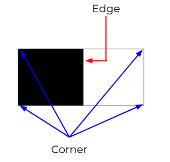
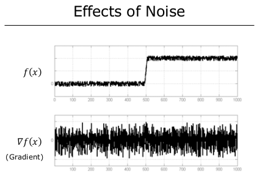
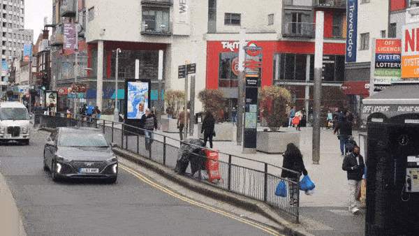
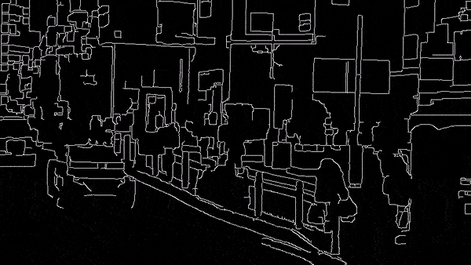

# Edge Detection

## Working
Edge is a rapid change in image intensity within a small region.



**Causes of Edge**
* Depth Discontinuity
* Surface normal discontinuity
* Surface reflactance discontinuity
* Illumination discontinuity


## Edge Detector 
Characteristics:   
* Gives edge position,magnitude,orientation  

In actual the edges aren't ideal. So, they can't be differentiated with just difference of internsity change only, we need rate of change of intensity as well.


## Edge Detection Using Gradients

### 1D Edge Detection
We use basic calculus which is derivative oof the intensity function. Derivative refers to the amount of change in the function and will give information regarding erratic intensity changes.

Local extrema in the first derivative tells us where the edges are located and the magnitude of peaks gives us the strengths of edges.


### 2D Edge Detection
For this we take partial derivative of intensity function with respect to both x and y.
And it is represented by Gradient Operator


```math
\nabla I = \big[ \frac{\partial I}{\partial x} , \frac{\partial I}{\partial y} \big]
```

Gradient Magnitude and Orientation can be found as
```math
Magnitude = ||\nabla I|| = \sqrt{(\frac{\partial I}{\partial x})^2+( \frac{\partial I}{\partial y})^2}
\\
\\
Direction (\theta) = tan^{-1}(\frac{\partial I}{\partial y} / \frac{\partial I}{\partial x})

```

Since digital imagees are discrete we use discrete gradient. i.e we use finite difference approximations for the partial derivatives with
respect to 𝑥 and 𝑦.


Thus, for digital image we can perform finite difference approximation using convolution operation.
A variety of gradient operators have been proposed using convolution approach.

* Larger Operator  
    * Better noise resiliance
    * Smoothing is incorporated
    * Poor Localization
* Small Operator
    * Good Localization
    * Noise Sensitive
    * Poor Detection


## Edge Thresholding
With the help of edge magnitude , we can further differentiate whether the pixel is actually edge or not

**Single Thresholding**

```math
\begin{cases}
||\nabla I(x,y)|| < T & \longrightarrow \text{Not an edge} \\
\;
\\
||\nabla I(x,y)|| > T & \longrightarrow \text{Definitely an edge}
\end{cases}
```


**Double Thresholding (Hysteresis based)**

```math
\begin{cases}
||\nabla I(x,y)|| < T_0 & \longrightarrow \text{Not an edge} 
\\ \; \\
||\nabla I(x,y)|| > T_1 & \longrightarrow \text{Definitely an edge}
\\ \; \\
T_0 \le||\nabla I(x,y)|| < T_1 & \longrightarrow \text{Definitely an edge}
\end{cases}
```


## Using Laplacian 
Just like gradient operator we can use laplacian operator aswell.

```math
\nabla^2 I = \frac{\partial^2 I}{\partial x^2} + \frac{\partial^2 I}{\partial y^2} 
```


## Noise
Noise affects edge detection so first we smooth the image with Gaussian Smoothing then apply edge detection.



Now after gaussian smoothing  


## Morphological Transformation

|              Dilation              |              Erosion              |
|:----------------------------------:|:----------------------------------:|
| Increases the size of objects in the image. | Decreases the size of objects in the image. |
| Expands the boundaries of objects. | Shrinks the boundaries of objects. |
| Pixels at the edges of objects are affected more than pixels in the interior. | Pixels in the interior of objects are affected more than pixels at the edges. |
| Used to fill small gaps between objects or to merge overlapping objects. | Used to remove small objects or to separate overlapping objects. |
| More likely to introduce noise and false detections. | Less likely to introduce noise and false detections. |
| Combining dilation and erosion can be used to perform morphological operations like opening and closing. | Combining erosion and dilation can also be used to perform morphological operations like opening and closing. |

 
```c++
cv::Mat erode_kernel = cv::Mat::ones(3, 3, CV_8U);
cv::Mat dilate_kernel = cv::Mat::ones(3, 3, CV_8U);
// Erosion
cv::erode(temp_image, temp_image, erode_kernel);
// Dilation
cv::dilate(temp_image, temp_image, dilate_kernel);
```


## Canny Edge Detection

Before applying edge detection algorithm, we convert it to single channel i.e grayscale. Then remove noise using gaussian blur and finally apply canny edge detection
 
```c++
cv::cvtColor(src_image,dst_image,cv::COLOR_BGR2GRAY);
```
```c++
cv::GaussianBlur(src_image,dst_image,{5,5},1);
// {5,5} is the kernel size
```
```c++
cv::Canny(src_image,dst_image,lower_threshold,upper_threshold);
```


## Original Video



## Edge Detected Video


## Eroded and Dilated Edge Detected Video


We can see manny small noises are removed due to erosion and dilation ( Morphological operation)