# Lane Detection for a Road Image

In this task, I will be detecting lanes with the help of opencv. I have tackled the program in this way
* **Apply canny edge detection**

* **First define the region of interest for the road.**

* **Apply Hough Transform to get lines list**

* **Calculate the slope of each line. And seperate the lines into left or right through their slope value**

* **Average out the slope and intercept of both left and right lanes.**

* **By fixing the y-value, get the 4 points for polyfill**


**This is the sample image from the video.**
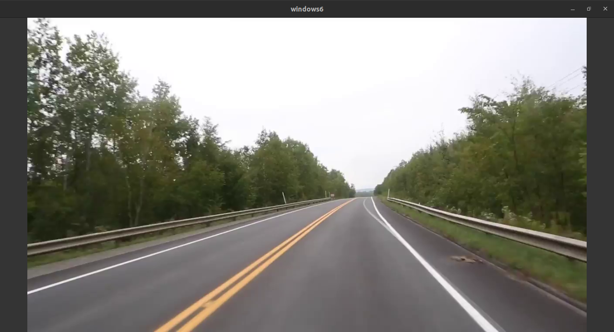

## Apply Canny Edge Detection
To detect lanes lines, first we convert the image into grayscale.


```c++
cv::cvtColor(src_img,dst_img,cv::COLOR_BGR2GRAY);
```
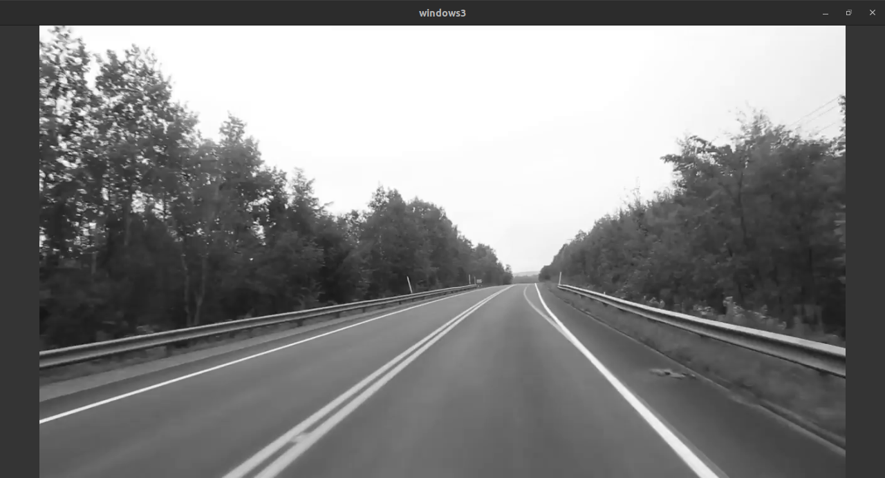

And then we apply canny edge detection on the grayscale image.

**Steps Involved in Canny Edge Detection Algorithm**

Canny Edge Detection is a popular method for identifying edges in images. It was developed by John F. Canny and consists of several stages:

 1. **Noise Reduction**

The algorithm starts by removing noise from the image using a 5x5 Gaussian filter.

2. **Finding Intensity Gradient**

Next, the smoothened image is filtered with a Sobel kernel to compute the gradient magnitude and direction.

3. **Non-maximum Suppression**

After getting gradient magnitude and direction, a full scan of image is done to remove any unwanted pixels which may not constitute the edge. For this, at every pixel, pixel is checked if it is a local maximum in its neighborhood in the direction of gradient. 

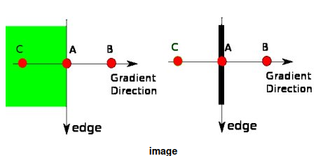

4. **Hysteresis Thresholding**

This stage classifies edges based on their intensity gradient values and connectivity. Edges above a certain threshold are retained, while those below are discarded unless they are connected to strong edges.

By applying these stages, Canny Edge Detection produces a binary image with strong edges.
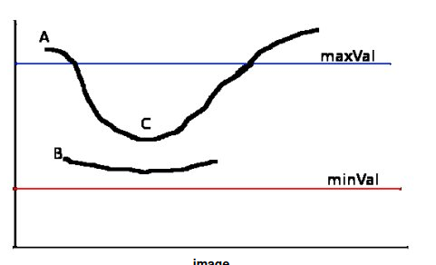

```c++
cv::Canny(src,dst,lower_threshold,upper_threshold);
```
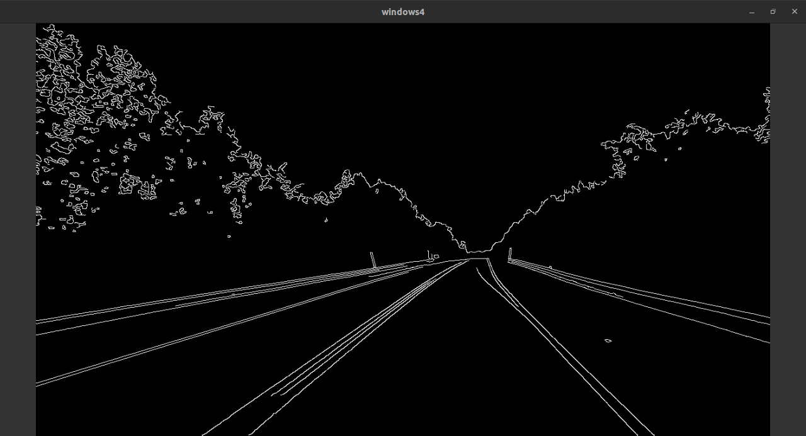

## ROI ( Region of Interest)
We remove the unnecessary part from our image to eliminate noise. Since we are doing lane detection task , we can cutout the sky and trees. To better detect the lane lines.

To remove unnecessary part from the image , first we create masking image. The masking image contains pixel with only two intensities value : `255` and `0`. `255` represent the pixel to keep and `0` represent the pixel to remove. So, when we do bitwise pixel `and` operation, the unnecessary portion are removed.

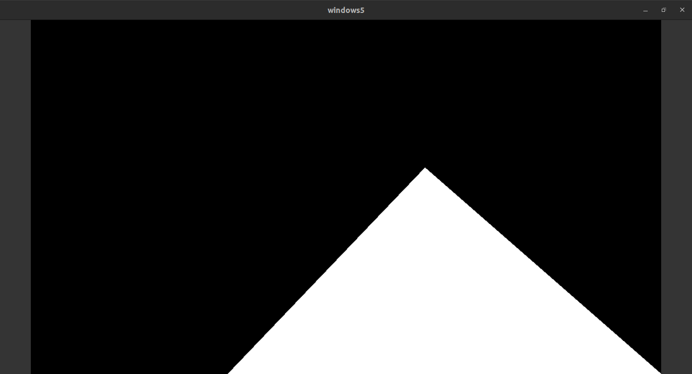
When this image passed through bitwise and operation to the canny edge detected image, we get the following desired image with region of interest.

```c++
cv::bitwise_and(mask_image,canny_img,merged_img);
```

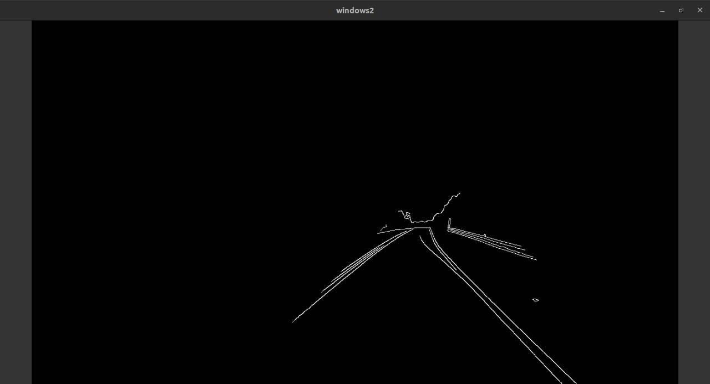


## Applying Hough Transform
This is algorithm used to detect straight lines. Before applying hough transform we do edge detection
* **Standard Hough Transform:**
    The traditional Hough Transform is a technique used to detect lines or other simple geometric shapes within an image. It works by mapping points in an image to parameter space, where each point corresponds to a potential line in the original image.
    In the Hough Transform for lines, the parameter space consists of two parameters: `slope (m)` and `intercept (b)` of the lines.
    For each point in the image, a set of curves in the parameter space is evaluated, and if enough points lie on the same curve, it is considered a potential line in the image.  

* **Probabilistic Hough Transform:**
    Computationally efficient
    Stochastically selects a subset of points and then fits lines only to those points. This makes it faster but may not find all the lines in the image.
    This process is repeated for a certain number of iterations or until a specified accuracy is reached.

```c++
 cv::HoughLinesP(dst, linesP, 1, CV_PI/180, 50, 50, 10 ); 

```
```
Arguments:
dst: Output of the edge detector. It should be a grayscale image (although in fact it is a binary one)
lines: A vector that will store the parameters (xstart,ystart,xend,yend) of the detected lines
rho : The resolution of the parameter r in pixels. We use 1 pixel.
theta: The resolution of the parameter θ in radians. We use 1 degree (CV_PI/180)
threshold: The minimum number of intersections to "*detect*" a line
minLineLength: The minimum number of points that can form a line. Lines with less than this number of points are disregarded.
maxLineGap: The maximum gap between two points to be considered in the same line.

```

## Hough Transform Working
When we convert the image space to parameter space. 
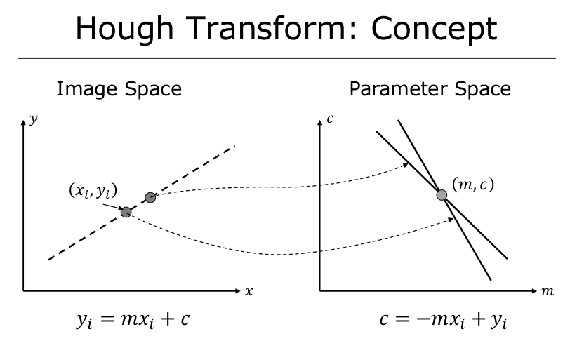
The lines with the same slope and intercept all intersect so it makes it easier to detect line.

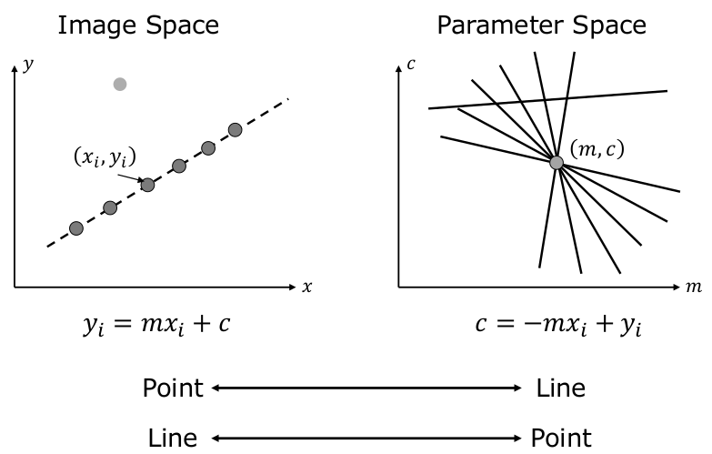


We can convert to polar space as well.
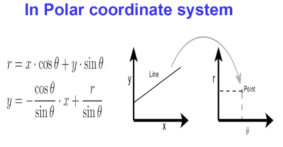


## Seperating Left and Right Lanes
Using hough transform we obtain different lane lines. Now, we need to convert these lines into left lanes and right lanes. We categorize them with the help of slope. A line consist of two points `(x1,y1)` and `(x2,y2)`. With this we can find the slope.
```math
Slope = \frac{y_2-y_1}{x_2-x_1}
\\
\;
\\

  \mathcal{Lane} =
  \begin{cases}
    \text{Left Lane} & \text{if $ slope > 0$ } \\
    \text{Right Lane} & \text{otherwise}
  \end{cases}

```


After seperating the lines we take average of their slope and intercept. Now this slope and intercept will be used to plot obtain points that bound the road and we do poly fill on it.

**Poly fill**
```c++
std::vector<cv::Point> poly_points = {left_start,left_end,right_end,right_start} ;
cv::fillConvexPoly( temp_image, poly_points , cv::Scalar(0,255,255) );
   
```

## Final Output

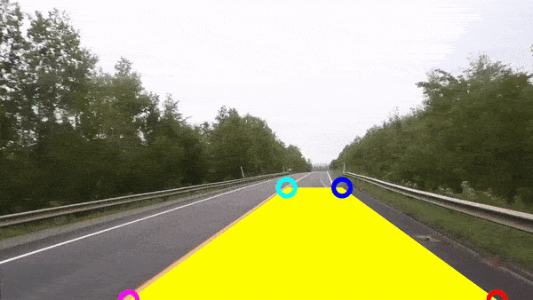
