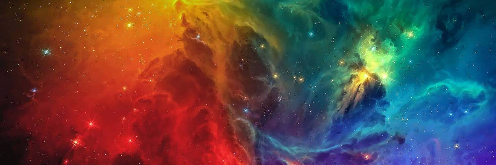
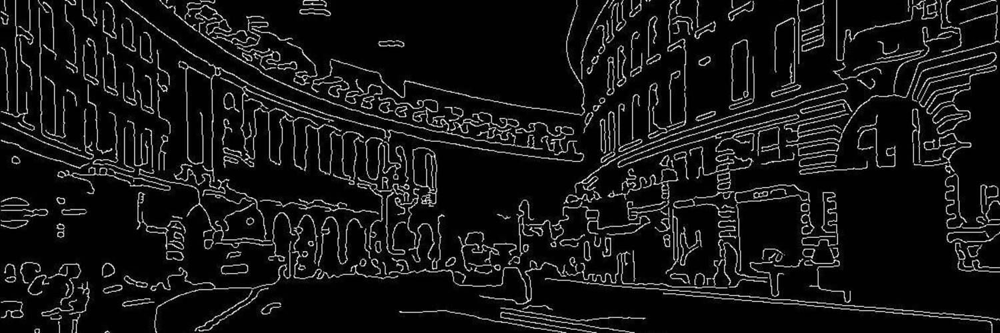
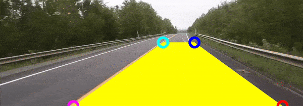

# Computer Vision Algorithms in C++
 

## Building Opencv

---

## Cmake

---
 
## Understanding Color Space

---

## Image Transformation

---

## Edge Detection

---

## Lane Detection

---

## 3D Transformation

---
 
